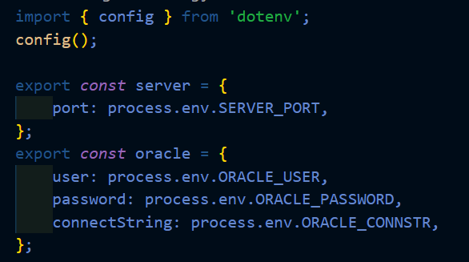
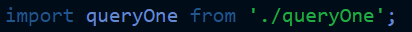
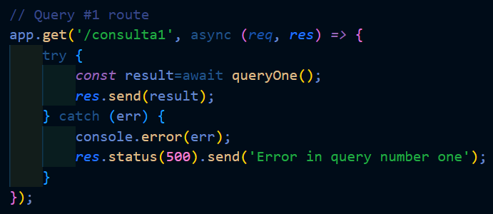
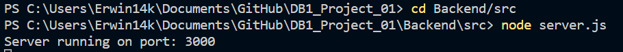
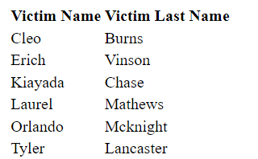

<html>
  <head>
    <meta charset="UTF-8">
  </head>
  <body>
    <h2>Erwin Fernando Vásquez Peñate</h2>
    <h2>202001534</h2>
    <h2>Sistemas De Bases De Datos 1</h2>
     
     
    <h1 style="text-align:center;">Proyecto 01</h1>
    <h2>Tecnologías Utilizadas</h2>
    <ul>
      <li>Base De Datos: Oracle DB, Versión 21c</li>
      <li>Backend: Node.Js Con Express</li>
    <ul>
     
     
    <h2 style="text-align:center;">Seguridad De Información</h2>
    

      Es muy importante que la información valiosa siempre se encuentre protegida y segura, por lo que no es una buena práctica dejar a simple vista las credenciales necesarias para acceder a una base de datos.
       
      Para preservar la información y credenciales de manera segura, se uso una librería llamada "dotenv", la cual, mediante un archivo ".env" permite recolectar toda la información sensible que ahí se almacene, recordando que este archivo ".env" no debe subirse al repositorio, luego para usar las variables de entorno en ese archivo, solo se importa la librería y pueden utilizarse, en este caso se creo un archivo llamado "config.js" , el cual exporta un objeto con todas las variables de entorno, así este archivo puede ser importado en culaquier archivo y usar las variables de entorno en cualquier momento, todo esto se logró de esta manera:  
    

    

      
    

     
     
    <h2  style="text-align:center;">API</h2>
    

      La api está hecha en Node.Js con Express, en la cual se definen los distintos endpoints para poder realizar consultas de la base de datos y poder visualizar los resultados en cualquier navegador, los endpoints disponibles son:
    

    <ul>
        <li>"/consulta1" : Mostrar el nombre del hospital, su dirección y el número de fallecidos por   cada hospital registrado.
        </li>
         
        <li>"/consulta2" : Mostrar el nombre, apellido de todas las víctimas en cuarentena que presentaron una efectividad mayor a 5 en el tratamiento “Transfusiones de sangre”.
        </li>
         
        <li>"/consulta3" : Mostrar el nombre, apellido y dirección de las víctimas fallecidas con más de tres personas asociadas.
        </li>
         
        <li>"/consulta4" : Mostrar el nombre y apellido de todas las víctimas en estado “Suspendida” que tuvieron contacto físico de tipo “Beso” con más de 2 de sus asociados.
        </li>
         
        <li>"/consulta5" : Top 5 de víctimas que más tratamientos se han aplicado del tratamiento “Oxígeno”.
        </li>
         
        <li>"/consulta6" : Mostrar el nombre, el apellido y la fecha de fallecimiento de todas las víctimas que se movieron por la dirección “1987 Delphine Well” a los cuales se les aplicó "Manejo de la presión arterial" como tratamiento.
        </li>
         
        <li>"/consulta7" : Mostrar nombre, apellido y dirección de las víctimas que tienen menos de 2 allegados los cuales hayan estado en un hospital y que se le hayan aplicado únicamente dos tratamientos.
        </li>
         
        <li>"/consulta8" : Mostrar el número de mes de la fecha de la primera sospecha, nombre y apellido de las víctimas que más tratamientos se han aplicado y las que menos. (Todo en una misma consulta).
        </li>
         
        <li>"/consulta9" : . Mostrar el porcentaje de víctimas que le corresponden a cada hospital.
        </li>
         
        <li>"/consulta10" : Mostrar el porcentaje del contacto físico más común de cada hospital de la siguiente manera: nombre de hospital, nombre del contacto físico, porcentaje de víctimas.
        </li>
         
        <li>"/cargarTemporal" : Carga masiva de datos a tabla temporal.
        </li>
         
        <li>"/eliminarTemporal" : Eliminar datos de la tabla temporal.
        </li>
         
        <li>"/cargarModelo" : Crear tablas del modelo y cargarle los datos.
        </li>
         
        <li>"/eliminarModelo" : Elimina las tablas del modelo de datos.
        </li>
         
    </ul>
    

      La API y los endpoints están configurados en el archivo "server.js", donde se importan los demás archivos donde se ejecutan las consultas a la base de datos, en este caso se mostrará el flujo del endpoint "/consulta1", pero para todos los enpoints es de manera similar.
    

     
    

      Se importa el archivo "queryOne.js" donde se hace la consulta a la base de datos.
    

    

      
    

     
    

      Se crea el endpoint "/consulta1" y se le da funcionalidad.
    

    

      
    

     
    

      Cada enpoint está de manera similar, lo único que cambia es cada archivo de cada consulta, ya que cada endpoint genera una consulta diferente.
    

     
    <h2 style="text-align:center;">Modelos</h2>
    

      Para evitar redundancia, inconsistencias y problemas en la base de datos, es importante contar con un buen diseño de la base de datos, para eso se realizarón los 3 modelos necesarios para la creación de la base de datos (Modelo Coneptual, Modelo Lógico y Modelo Físico), para poder ver cada uno de los modelos, puedes dirigirte a cada uno de ellos en los siguientes enlaces:
    

     
    <ul>
      <li><a href="https://github.com/Erwin14k/DB1_Project_01/blob/main/Models/Conceptual_Model.pdf">Modelo Conceptual</a></li>
      <li><a href="https://github.com/Erwin14k/DB1_Project_01/blob/main/Models/Logical_Model.pdf">Modelo Lógico</a></li>
      <li><a href="https://github.com/Erwin14k/DB1_Project_01/blob/main/Models/ER_Model.pdf">Modelo Físico</a></li>
    </ul>
     
    <h2 style="text-align:center;">Uso De la aplicación</h2>
    

      Para levantar el servidor en Express, solo nos dirigimos a la carpeta "Backend", y utilizamos el siguiente comando:
    

    

      
    

     
    

      Para la base de datos, para este proyecto se manejó oracle de manera local (instalada de manera física), pero la conexión a la base de datos es similar, solo cambiaría el host, que por ejemplo si fuera una instancia en la nube sería la ip externa junto con el "ORACLE_CONNSTR".
    

     
    <h2 style="text-align:center;">Despliegue En El Navegador</h2>
     
    

      Una vez levantado el servidor, solo faltaría abrir un navegador y dirigirnos a cualquier endpoint disponible, aquí se muestra un ejemplo con el endpoint "/consulta2".
    

    

      
    

    

      
    

  </body>
</html>